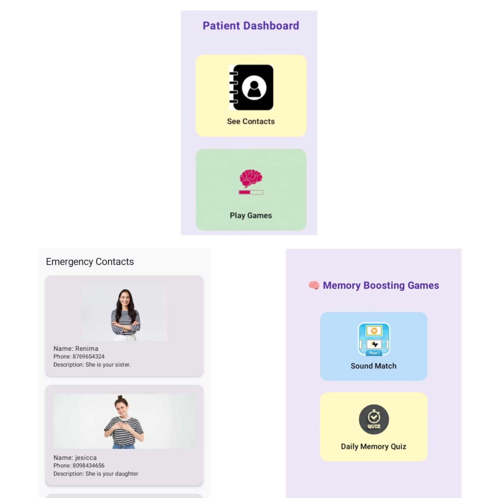

# 🧠 Dementia Care App

A comprehensive Android-based application designed to support dementia and Alzheimer’s patients through safety features, caregiver tools, cognitive exercises, and real-time alerts.

---

## 📱 Features

### 👤 Patient Module
- **View Contacts**: View emergency contacts saved by caregivers in a card-based, non-editable format.
- **Memory Boosting Games**: Play offline cognitive stimulation games like sound match, daily quiz, and face-name matching.

### 🧑‍⚕️ Caregiver Module
- **Save Contacts**: Add contact name, photo, phone number, and description. Stored securely and accessed offline.
- **Medication Reminder**: Schedule alerts with time, name, and days for patient medication.
- **Voice Alerts / Buzzer**: Record or schedule custom audio reminders or set buzzer alarms.
- **Safe Zone GPS Alerts**: Set home radius and receive alerts if the patient goes out of the safe zone.

---

## 🛠️ Tech Stack

- **Frontend**: Kotlin, Jetpack Compose
- **Backend**: Android Services & Local Storage (SharedPreferences)
- **Testing**: JUnit, Espresso
- **Permissions**: Location, Audio Recording, Storage

---

## ✅ Functional Highlights

- Role-based access: Separate functionalities for patients and caregivers.
- Offline functionality: All major modules work without internet connectivity.
- Secure actions: Password authentication before editing sensitive caregiver data.

---

## 🔐 Permissions Required

| Feature           | Permission               |
|------------------|--------------------------|
| Location Tracking| `ACCESS_FINE_LOCATION`   |
| Voice Recording  | `RECORD_AUDIO`           |
| File Storage     | `READ_EXTERNAL_STORAGE`  |

---

<h3>📷 Screenshots</h3>

<table>
  <tr>
    <td></td>
    <td></td>
  </tr>
  <tr>
    <td></td>
    <td></td>
  </tr>
  <tr>
    <td></td>
    <td></td>
  </tr>
  <tr>
    <td></td>
    <td></td> <!-- Leave blank if odd number of images -->
  </tr>
</table>


---

## 🚀 Getting Started

### Prerequisites
- Android Studio (Flamingo+)
- Android SDK 31+
- Kotlin 1.8+

### Installation
1. Clone this repo:
   ```bash
   git clone https://github.com/yourusername/dementia-care-app.git
